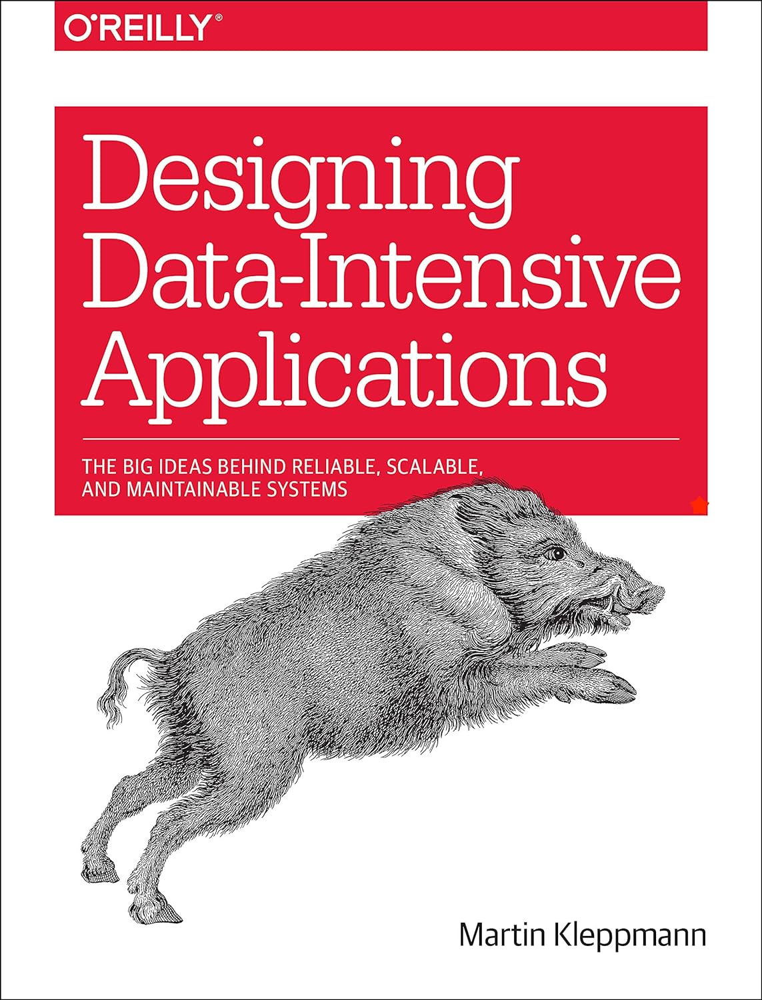

# 데이터 중심 애플리케이션

### 스터디원

- 권민준 ( @MinJunKweon )
- 양희찬 ( @log-info )
- 조민국 ( @minkukjo )
- 남해울 ( @HaeUlNam )
- 이도현 ( @2rohyun )

### 스터디 방식

- 매주 한 챕터씩 Issue를 생성해서 각자 중요한 내용을 정리해서 코멘트를 남깁니다.
  - 코멘트 내용은 중요한 부분을 정리한 것이나, 질문, 추가로 알면 좋은 내용들을 남깁니다.
- 매주 일요일 22시마다 온라인으로 간단하게 미팅을 진행합니다.
  - 플랫폼 : Zoom, Google Meet

### Reference

- [교보문고 - 데이터 중심 애플리케이션 설계](https://product.kyobobook.co.kr/detail/S000001766328)
